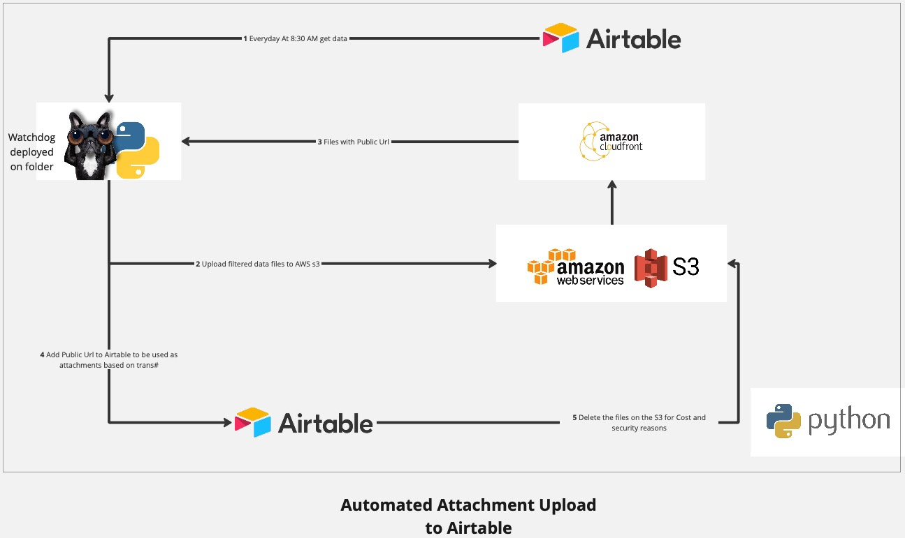

#  Automate Attachments in Airtable (using Watchdog)

Watchdog File Uploader is a Python-based automation tool designed to monitor a specified folder for new files, process them, and perform various actions, including uploading files to Amazon S3 and updating records in Airtable. This tool streamlines the process of managing attachments in Airtable records based on transaction numbers, enhancing efficiency and data integrity.

## Features

- **Folder Monitoring:** Monitors a designated folder for new file creations using the Watchdog library.
- **File Processing:** Extracts transaction numbers from filenames and adds file information to a DataFrame for further processing.
- **Airtable Integration:** Retrieves transaction data from Airtable, filters the DataFrame, and updates Airtable records with attachment URLs.
- **Amazon S3 Integration:** Uploads files to Amazon S3 for secure storage and generates unique URLs for each file.
- **Scheduled Actions:** Executes specific actions, such as data retrieval and processing, at predefined times (e.g., 8:30 AM daily).
- **Logging and Error Handling:** Implements logging for informational messages and error handling to ensure smooth execution and facilitate troubleshooting.

## Requirements

- Python 3.x
- pip (Python package manager)
- Required Python libraries: `pandas`, `watchdog`, `requests`, `boto3`

## Further Reading

For a detailed explanation of the project and its implementation, check out the accompanying Medium article:

[ Automate Attachments in Airtable (using Watchdog)](https://sungajiwala54.medium.com/automating-attachment-management-in-airtable-the-watchdog-file-uploader-project-b48cde44cb22)

## References

- [Watchdog Documentation](https://python-watchdog.readthedocs.io/en/latest/index.html) - Official documentation for the Watchdog library used for monitoring file system events.
- [Airtable API Documentation](https://airtable.com/api) - Documentation for the Airtable API, providing information on how to interact with Airtable programmatically.
- [Boto3 Documentation](https://boto3.amazonaws.com/v1/documentation/api/latest/index.html) - Official documentation for Boto3, the AWS SDK for Python, used for interacting with Amazon S3.

